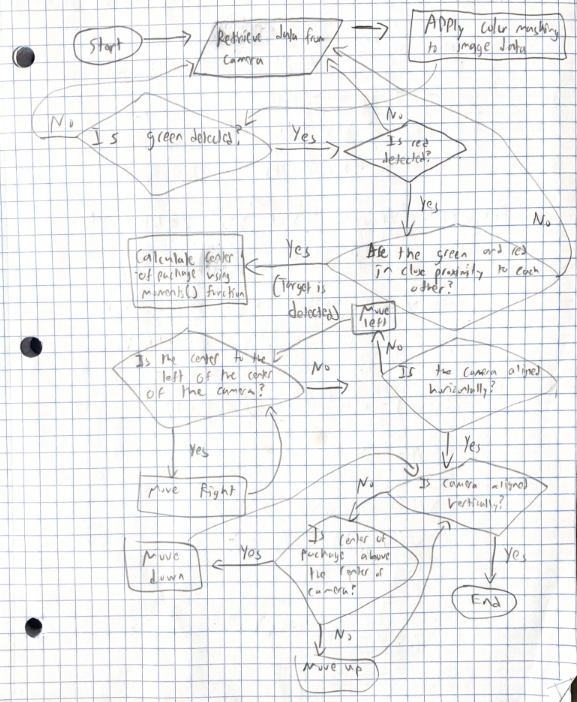
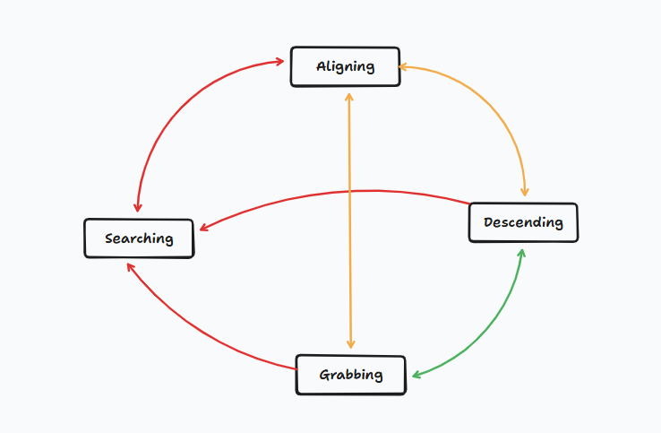
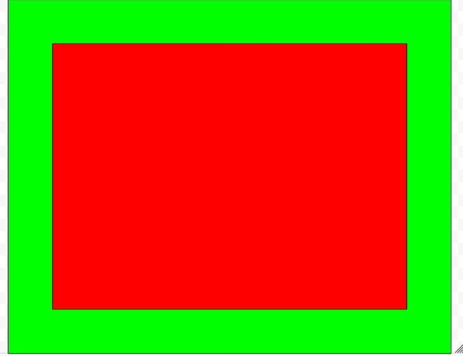
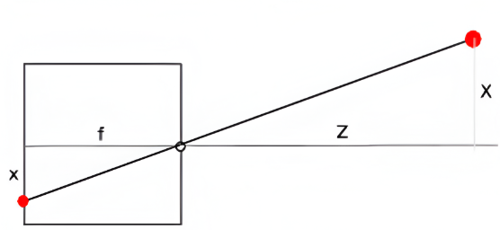

# Payload Dropping Drone Project for Digital Electronics

Here you will find the codebase for Sanchay and I's project (although Sanchay has his repository [here](https://github.com/Chrohma/Payload-Dropping-Drone-DE-Final-Sanchay-Koppa))

## **Required Libaries**
- OpenCV
- NumPy
- Matplotlib
- simple-pid

## Overview

The goal of this project was to create a drone that has the capability of autonomously detecting and picking up packages. However, due to time constraints, my partner, Sanchay, and I decided to focus on just the claw mechanism along with the alignment code, which is the part I worked on.

## Structure

Before I started coding, I made a flowchart and a state machine diagram to effectively map out how the code will function. Below, the flowchart shows how the code will go from a video stream -> detecting a package -> giving pseudocommands to the drone on how to move

I decided to use a state machine approach when designing the alignment code as it provides an easy way to know when the drone is in each of the four states, searching, aligning, descending, and grabbing. Below is the diagram of the possible transitions between the four states.

## Package Detection

The first part of the program is the package detection which can be split up into two main parts, color masking, and noise reduction. 

#### Color Masking

The way we planned on designing the package was to have two bright colors, red and green, with green on the outer edge of the package, and red on the inside. The reason for this is to make detecting the package easier, and having two colors will reduce the likelihood of detecting an object that is not the package. 

In this project, I mainly used OpenCV for the image processing, and essentially, I first applied two color masks that will filter out everything except for the colors red and green respectively. From these color masks, we can then figure out exactly where the colors red and green show up on screen. The continuous green/red "areas" on screen are known as contours.

#### Noise Reduction

Once we have these two color masks, the next thing I implemented was determining whether the area of the green/red contours were significant enough to be considered. This was done to filter out small "specks" of red and green that might be present in the view of the camera. Next, the program determines the center of the red and green contours using the moments() function from OpenCV. The moments() function can find the center of a contour by taking the weighted sum of the x/y pixel positions multiplied by the pixel intensity, and then dividing these values by the area to get the center-x and center-y. 

After calculating the center of the red and green contours, the program determines whether these centers are close enough to each other to be considered the package. Since the package is rectangular, the center of the green contours and red contours should theoretically be in the same spot.

Finally, if these contour centers are close enough to each other, then they are averaged out, and the "average" center of the package is displayed on screen. 

## Alignment

The alignment part of the program is somewhat simple. Once we know where the center of the package is relative to the center of the screen (assuming that the camera is mounted such that the center of the camera matches the center of the claw), the program can determine whether the drone needs to move left, right, forwards, or backwards to align to the target.

Initially, I believed that this approach of using relative alignment would be able to function fine. However, after discussing with an industry-level engineer, Mr. Marc-Aurele, I realized that it would be better to determine the horizontal distance to the package, and use absolute alignment. This brings us to the next section, which involves using optics.

## Camera Optics for Determining Horizontal Distance

As a quick background, the way we can determine horizontal distance from the camera to the package is through using knowns such as the focal length of the camera (in pixels), the height of the camera, using the barometric air pressure sensor that is incorporated in the flight controller we will be using for the drone, etc. 

To keep things straightfoward, I will be using the pinhole camera model. The picture below illustrates what this model looks like.

f represents the focal length of the camera, x is the distance from the pinhole/focal axis in pixels, X is one of the components of the distance to the object, and Z is the height of the object.

Using similar triangles, we can determine that:

$x=f\cdot \frac{X}{Z}$, and although y is not shown, the same approach can be used, where $y=f\cdot \frac{Y}{Z}$

We also know that the focal axis of the camera passes through the center of the camera, and the x/y distances in pixels are measured from this focal axis. In programming conventions, however, $(0,0)$ represents the top left corner of an image frame, which means that to get the position of the object on the image frame, we need to add the coordinates $(c_x, c_y)$ to the calculated $(x,y)$ coordinates, where $c_x$ is the middle of the screen in the x-direction, and $c_y$ is the middle of the screen in the y-direction.

In general, this process can be encoded by a matrix $K$, such that

$$
K =
\begin{bmatrix}
f & 0 & c_x \\
0 & f & c_y \\
0 & 0 & 1
\end{bmatrix}
$$

If we apply this matrix to the camera coordinates $(\frac{X}{Z}, \frac{Y}{Z}, 1)$, we can get the image coordinates $(x, y, 1)$

$$
\begin{bmatrix}
x \\
y \\
1
\end{bmatrix}
=
\begin{bmatrix}
f & 0 & c_x \\
0 & f & c_y \\
0 & 0 & 1
\end{bmatrix}
\begin{bmatrix}
\frac{X}{Z} \\
\frac{Y}{Z} \\
1
\end{bmatrix}
$$

Now that we have defined the forward process of going from camera coordinates to image coordinates, we can determine the reverse process of back-projecting a vector to determine camera coordinates from image coordinates.

The reverse process will simply be:

$$
\begin{bmatrix}
\frac{X}{Z} \\
\frac{Y}{Z} \\
1
\end{bmatrix}
=
K^{-1}
\begin{bmatrix}
x \\
y \\
1
\end{bmatrix}
$$

where $K^{-1}$ is the inverse matrix of the camera matrix $K$

On the drone, we will have a barometer which can tell us the altitude of the drone. If we take note of the altitude on takeoff, we can determine the altitude relative to that starting position. Since $Z$ represents the altitude assuming no tilt of the drone (which is an ideal scenario), we can multiply the resultant vector by the altitude, or:

$$
Z = \text{altitude}
$$

$$
Z
\begin{bmatrix}
\frac{X}{Z} \\
\frac{Y}{Z} \\
1
\end{bmatrix}
=
\begin{bmatrix}
X \\
Y \\
Z
\end{bmatrix}
$$

From here, we can determine the norm of the vector $\begin{bmatrix}X \\ Y \end{bmatrix}$, and this will be the horizontal distance.